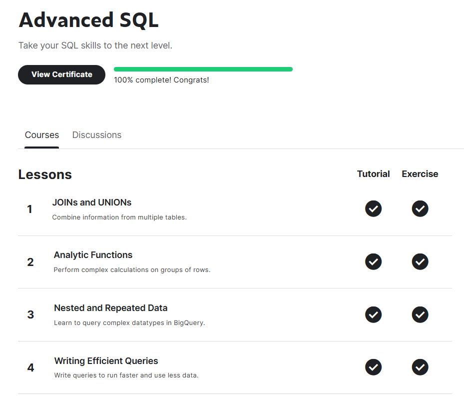

# <https§§§www.kaggle.com§learn§advanced-sql>
> <https://www.kaggle.com/learn/advanced-sql>

# Advanced SQL

## 0 JOINs and UNIONs
[joins-and-unions](./joins-and-unions.ipynb)
[here](./exercise-joins-and-unions.ipynb)

## 1 Analytic Functions
[joins-and-unions](./joins-and-unions.ipynb)
[here](./exercise-analytic-functions.ipynb)

## 2 Nested and Repeated Data
[nested-and-repeated-data](./nested-and-repeated-data.ipynb)
[here](./exercise-nested-and-repeated-data.ipynb)

# 3 Writing Efficient Queries
[writing-efficient-queries](./writing-efficient-queries.ipynb)
[here](./exercise-writing-efficient-queries.ipynb)

https://www.kaggle.com/datasets

