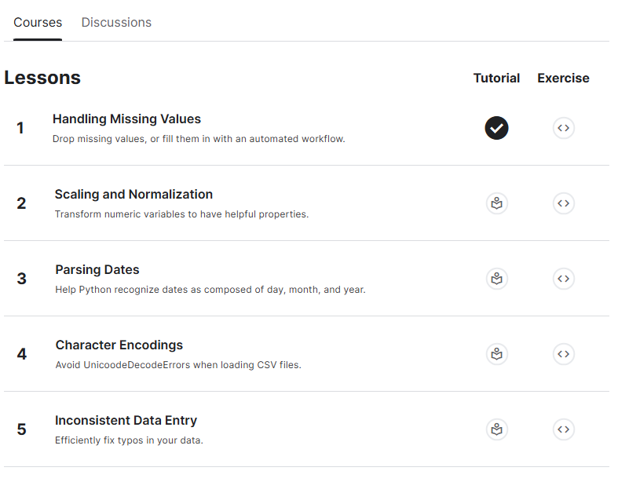

# <https§§§www.kaggle.com§learn§data-cleaning>
> <https://www.kaggle.com/learn/data-cleaning>

# Data Cleaning

# 0  Handling missing values
[here](./handling-missing-values.ipynb)
[here](./exercise-handling-missing-values.ipynb)

# 1 

# 2 Parsing Dates
[here](./parsing-dates.ipynb)
[here](./exercise-parsing-dates.ipynb)

# 3 

# 4 Inconsistent Data Entry
[here](./inconsistent-data-entry.ipynb)
[here](./exercise-handling-missing-values.ipynb)