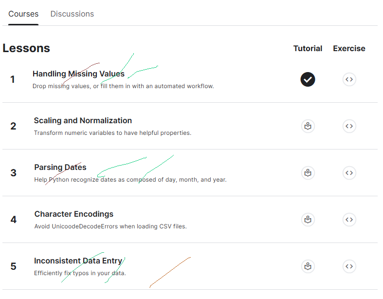

# <https§§§www.kaggle.com§learn§data-cleaning>
> <https://www.kaggle.com/learn/data-cleaning>

# Data Cleaning

# 0  Handling missing values
[here](./handling-missing-values.ipynb)
[here](./exercise-handling-missing-values.ipynb)