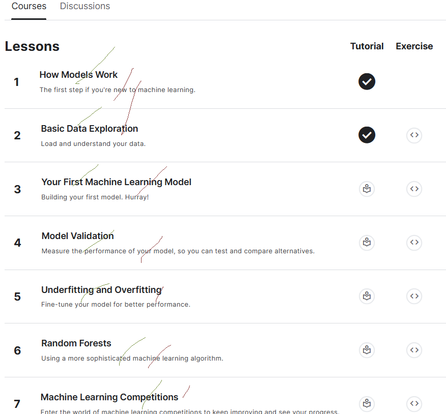

# <https§§§www.kaggle.com§learn§intro-to-machine-learning>
> <https://www.kaggle.com/learn/intro-to-machine-learning>

# Intro to Machine Learning

## 0 Getting Started With SQL and BigQuery
[here](./how-models-work.ipynb)

## 1 Basic Data Exploration
[here](./basic-data-exploration.ipynb)
[here](./exercise-explore-your-data.ipynb)

## 2 Your First Machine Learning Model
[here](./your-first-machine-learning-model.ipynb)
[here](./exercise-your-first-machine-learning-model.ipynb)

## 3 Model Validation
[here](./model-validation.ipynb)
[here](./exercise-model-validation.ipynb)

## 4 Underfitting and Overfitting
[here](./underfitting-and-overfitting.ipynb)
[here](./exercise-underfitting-and-overfitting.ipynb)

## 5 Random Forests
[here](./random-forests.ipynb)
[here](./exercise-random-forests.ipynb)

## 6 Machine Learning Competitions
[here](./machine-learning-competitions.ipynb)
[here](./exercise-machine-learning-competitions.ipynb)