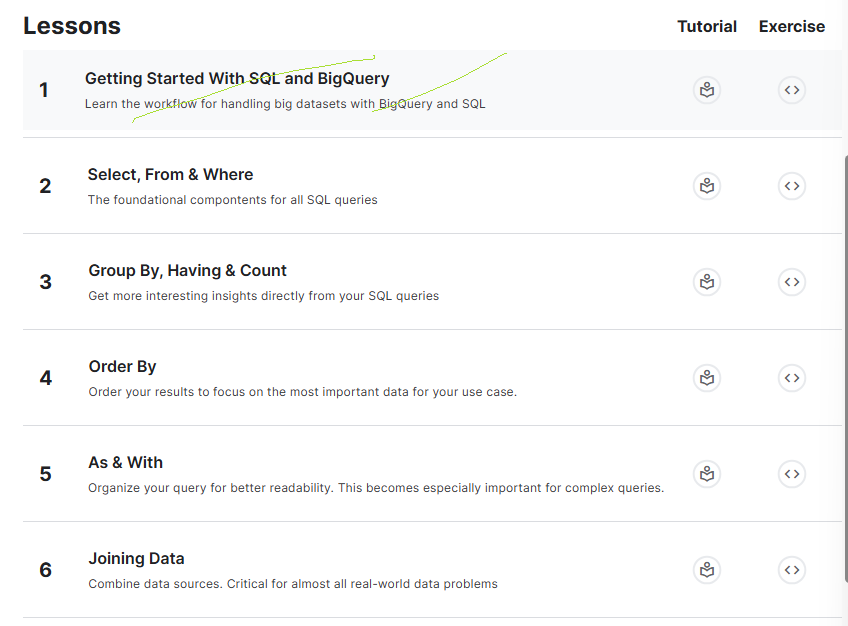

# <https§§§www.kaggle.com§learn§intro-to-sql>
> <https://www.kaggle.com/learn/intro-to-sql>

# https://www.kaggle.com/learn/intro-to-sql

)

## 0 Getting Started With SQL and BigQuery
[readme0](./readme0.ipynb)

[exercise0](./exercise0.ipynb)

## 1 Select, From & Where
[readme1](./readme1.ipynb)

[exercise1](./exercise1.ipynb)

## More 

[here](./Group_By_Having_Count.ipynb)
[here](./AsWith.ipynb)
[here](./Joining_Data.ipynb)
[here](./Order_By.ipynb)