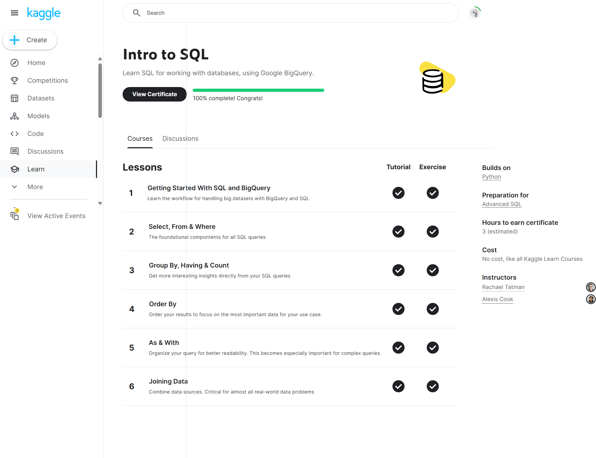
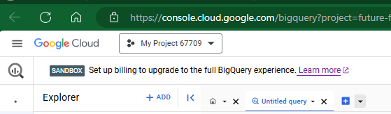
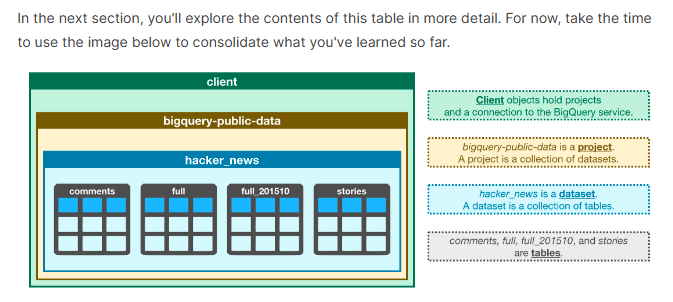
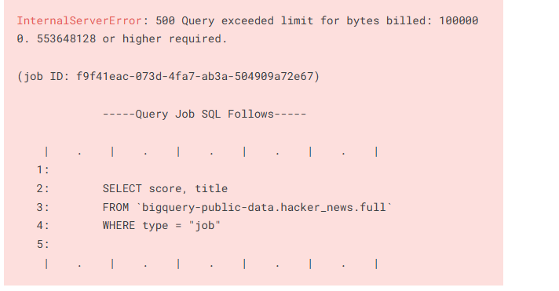

# <https§§§www.kaggle.com§learn§intro-to-sql>
> <https://www.kaggle.com/learn/intro-to-sql>

# https://www.kaggle.com/learn/intro-to-sql



## 0 Getting Started With SQL and BigQuery
[readme0](./readme0.ipynb)




## More 

```
as-with.ipynb
getting-started-with-sql-and-bigquery.ipynb
group-by-having-count.ipynb
joining-data.ipynb
order-by.ipynb
select-from-where.ipynb

exercise-as-with.ipynb
exercise-getting-started-with-sql-and-bigquery.ipynb
exercise-group-by-having-count.ipynb
exercise-joining-data.ipynb
exercise-order-by.ipynb
exercise-select-from-where.ipynb
```
