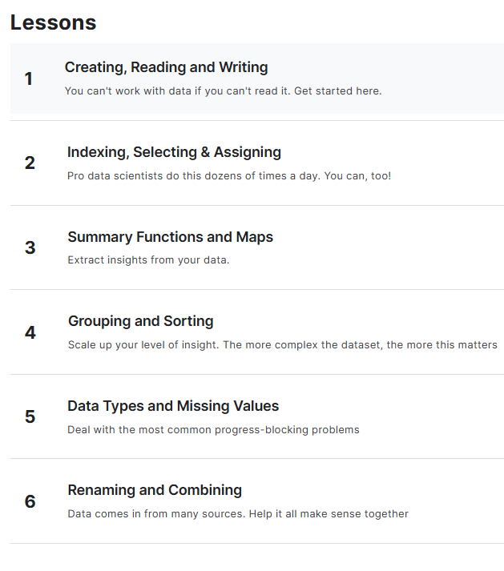

# <https§§§www.kaggle.com§learn§pandas>
> <https://www.kaggle.com/learn/pandas>

# pandas

## 0 Creating, Reading and Writing 
[readme0](./readme0.ipynb)
[exercise0](./exercise0.ipynb)

## 1 Indexing, Selecting & Assigning
[readme1](./readme1.ipynb)
[exercise1](./exercise1.ipynb)

## 2 : Summary Functions and Maps
[readme2](./readme2.ipynb)
[exercise2](./exercise2.ipynb)