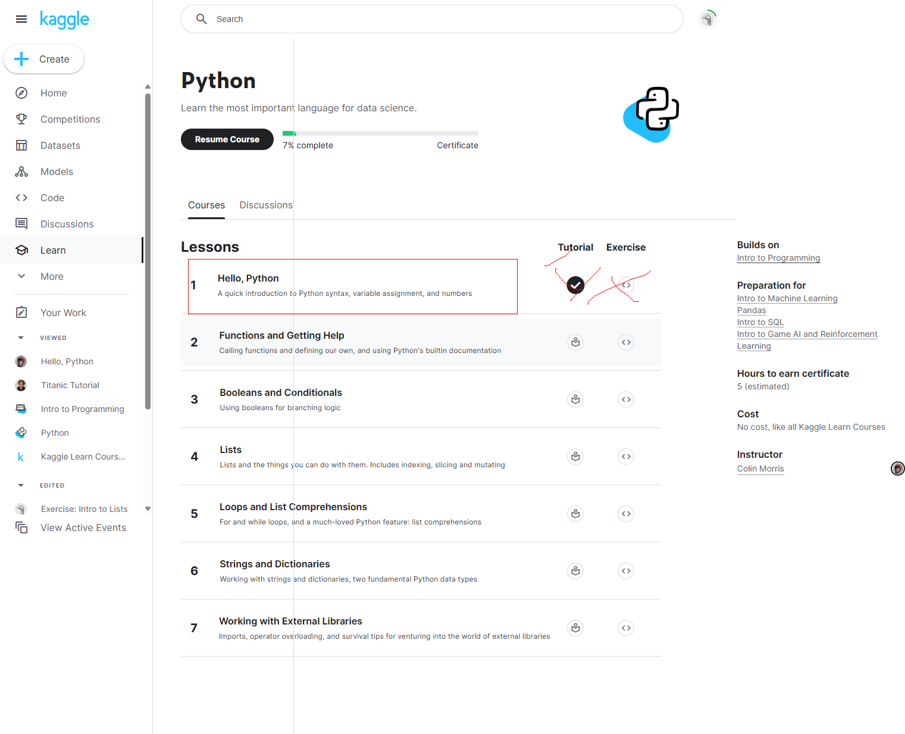

# <https§§§www.kaggle.com§learn§python>
> <https://www.kaggle.com/learn/python>

## 0 hello python 
[readme0](./readme0.ipynb)
[exercise0](./exercise0.ipynb)

## 1 function and getting help
[readme1](./readme1.ipynb)
[exercise1](./exercise1.ipynb)

## Booleans and Conditionals
[readme2](./readme2.ipynb)
[exercise2](./exercise2.ipynb)

## Lists
[readme3](./readme3.ipynb)
[exercise3](./exercise3.ipynb)

## Lists
[readme4](./readme4.ipynb)
[exercise4](./exercise4.ipynb)

## Strings and Dictionaries
[readme5](./readme5.ipynb)
[exercise5](./exercise5.ipynb)

## Working with External Libraries
[readme6](./readme6.ipynb)
[exercise6](./exercise6.ipynb)

