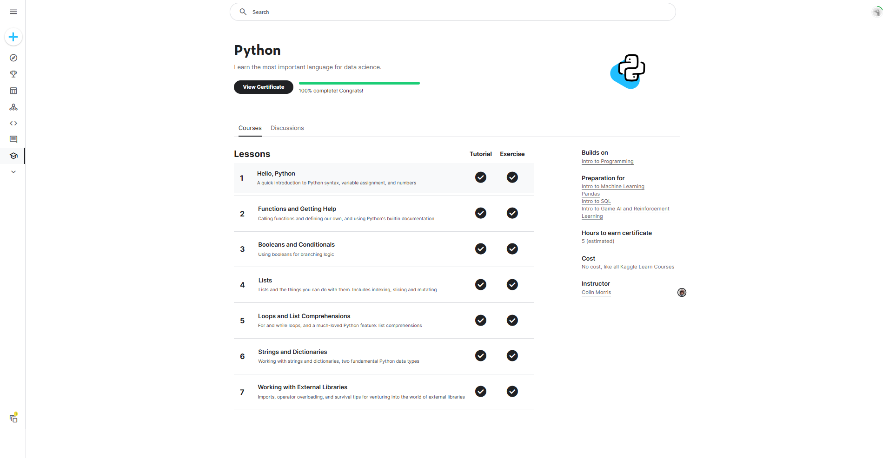

# <https§§§www.kaggle.com§learn§python>
> <https://www.kaggle.com/learn/python>

## 0 hello python 
[readme0](./readme0.ipynb)
[exercise0](./exercise0.ipynb)

## 1 function and getting help
[readme1](./readme1.ipynb)
[exercise1](./exercise1.ipynb)

## Booleans and Conditionals
[readme2](./readme2.ipynb)
[exercise2](./exercise2.ipynb)